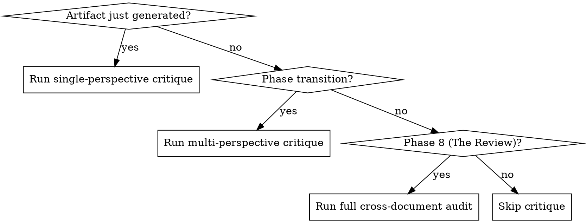

# Critique Loop

Iterative review process that catches what the author misses. Every generated artifact goes through at least one critique round before the user sees it. Major artifacts get multiple rounds from different perspectives.

## When to Use



## The Three Critique Modes

### 1. Quick Critique (per-artifact)

After generating any single document, run a quick self-review:
- Does it match the template from janna:document-forge?
- Are cross-references valid?
- Is terminology consistent with existing artifacts?
- Does it apply janna:lean-product-strategy where relevant?
- Is it free of vague language ("various", "etc.", "and more")?

Fix issues inline. No separate output file needed.

### 2. Perspective Critique (per-phase)

At each phase transition, dispatch subagent(s) to review from specific angles. The critic adopts a persona (from janna:persona-generation critic perspectives) and reviews the phase output.

**Critique prompt template:**

```
You are [PERSPECTIVE NAME] — [one-sentence description of this critic's angle].

Review the following document(s) for:
1. [Perspective-specific concern 1]
2. [Perspective-specific concern 2]
3. [Perspective-specific concern 3]
4. Consistency with: [list upstream artifacts to check against]

For each issue found, provide:
- **Location:** Which document, which section
- **Issue:** What's wrong (be specific)
- **Severity:** Critical (blocks progress) | Important (should fix) | Minor (nice to fix)
- **Suggestion:** How to fix it

If everything looks solid, say so. Don't manufacture issues.
```

**Standard perspectives by phase:**

| Phase | Perspectives |
|-------|-------------|
| 1 (Architecture) | Systems Architect, Pragmatic Engineer |
| 2 (PRD) | Product Strategist, The Customer, Security Engineer |
| 3 (Personas) | UX Advocate (are personas diverse and grounded?) |
| 4 (Stories) | The Customer, Pragmatic Engineer |
| 5 (Agile) | Pragmatic Engineer (are sprints realistic?) |
| 6 (Test Plan) | Systems Architect, Security Engineer |
| 7 (Pitch) | Product Strategist, The Customer |

### 3. Cross-Document Audit (Phase 8)

Full alignment review across the entire artifact set:

**Requirement Tracing:**
- Every PRD requirement → at least one user story → at least one agile task → at least one test
- Flag orphaned requirements (in PRD but no story)
- Flag orphaned stories (story but no PRD basis)
- Flag untested requirements

**Terminology Consistency:**
- Extract key terms from each doc type
- Flag inconsistencies (e.g., "entity" in PRD but "node" in user stories)
- Propose canonical terms

**Version/Timeline Consistency:**
- Feature version assignments consistent across overview, PRDs, and agile
- Sprint timelines realistic given dependency graph
- Pitch deck roadmap matches agile plan

**Claim Verification:**
- Every claim in pitch deck is backed by a PRD spec
- Overview feature descriptions match PRD definitions
- Market size claims have stated methodology

## The Iteration Protocol

```
WHILE issues remain:
    Run appropriate critique mode
    Categorize issues by severity
    Present Critical + Important issues to user
    Get user decision on each: fix | accept | defer
    Apply fixes
    Re-run critique on changed sections only
    IF no new Critical/Important issues in this pass → DONE
```

**Max iterations:** 3 per critique round. If still finding Critical issues after 3 passes, surface to user — something structural needs their attention.

**Never:** Fix issues silently without presenting them. The user is the navigator.

## Synthesizing Multi-Perspective Feedback

When multiple critics review the same artifact:

1. **Group by location** — Multiple critics flagging the same section = high signal
2. **Resolve contradictions** — Critics may disagree. Present both views to user.
3. **Prioritize convergence** — If 3 of 4 critics flag the same issue, it's real
4. **Preserve dissent** — One critic's unique insight may be the most valuable

**Output format for synthesis:**

```markdown
## Critique Synthesis — [Phase Name]

### Convergent Findings (all/most critics agree)
- [finding] — flagged by [critics]

### Divergent Findings (critics disagree)
- [topic]: [Critic A] says [X], [Critic B] says [Y]. Recommendation: [your call]

### Unique Insights (one critic, high value)
- [finding] from [critic] — worth considering because [reason]

### Action Items
- [ ] [specific fix] — Severity: [Critical/Important/Minor]
```

## Integration

- **janna:persona-generation** provides critic perspectives
- **janna:document-forge** provides templates to validate against
- **Phase 8 of janna:napkin-to-spec** is the full cross-document audit
- Dev team personas from Phase 3 become critics in Phase 8
