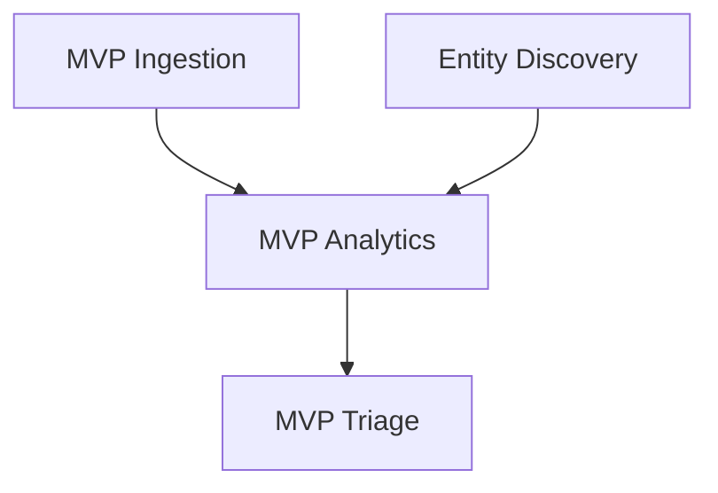

**Skill type: FLEXIBLE** — Adapt to context, but document every deviation.

# Document Forge

Templates and quality standards for every document type in the napkin-to-spec pipeline. These are structural guides, not fill-in-the-blank forms — adapt to the product's reality.

## Universal Rules

1. **Cross-reference everything.** Every document should link to related docs. Use relative paths: `[PRD-03](../prd/03-entity-resolution.md)`
2. **Anchor IDs.** Requirements, stories, epics, and test cases get unique IDs for traceability. Format: `REQ-[AREA]-[NNN]`, `US-[PERSONA]-[NNN]`, `E-[NNNN]`, `TC-[AREA]-[NNN]`
3. **Use specific language.** Replace "various", "etc.", "and more", "as needed", "appropriate" with concrete details, or mark `[TODO: specify]` for later resolution.
4. **Version awareness.** Tag features with their target version: `(v1)`, `(v1.1)`, `(future)`.
5. **Lean bias.** Apply janna:lean-product-strategy to every document. Self-service is the default.
6. **Team voices in ACs.** Embed perspective commentary in acceptance criteria: `[Role: concern]` — shows *why* priorities exist, not just what they are. (In Phase 1, use generic role labels like `[Security:]` or `[Ops:]`. After Phase 6, replace with actual team member names during Phase 7 feedback rounds.)
7. **Cross-cutting concerns.** Every epic's ACs must include observability, security, and accessibility criteria — these are woven in, not bolted on.
8. **Honest limitations.** For every feature deferred to a later version, generate a limitations entry: what's the gap, what's the workaround, when is it planned.
9. **Release tiers as hard gates.** Release tiers (R1, R2, R3...) aren't just labels — all stories in R1 must complete before any R2 story starts. Generate blocking relationships accordingly.
10. **Persona coverage matrix.** After generating stories, produce a matrix showing which personas are served by which stories. Flag any persona with fewer than 3 stories.
11. **Integration testing.** Every sprint adding visible features must include at least one integration story (1–3 SP) wiring subsystems together. No sprint plan is complete without it.

---

## Product Axioms

Non-negotiable properties that must be true at every sprint boundary. These trace to test cases the same way requirements do. Verify every sprint.

| ID | Axiom | Verification |
|----|-------|-------------|
| AX-001 | **App launches.** The application starts and displays non-default output on all target platforms. | Lights-on story AC + TC-SYS-ADV-001 |
| AX-002 | **Core function works.** The application performs its primary function end-to-end with observable output. | Golden path E2E test |
| AX-003 | **Component outputs are compatible.** Every subsystem's output is accepted by its downstream consumer without format conversion, silent coercion, or data loss. | Integration tests + TC-SYS-ADV-002 |
| AX-004 | **Walking skeleton is observable.** At least one user-facing workflow is exercisable from entry point to visible result. | Sprint demo with actual application output |

Axioms are not aspirational — they are hard gates. A sprint that breaks an axiom is not done regardless of story completion.

---

## PRD Template

**File:** `docs/prd/NN-[area-name].md`

```markdown
# PRD-NN: [Feature Area Name]

**Status:** Draft | Review | Approved
**Version:** v[X]
**Owner:** [dev team persona name — TBD until Phase 6, assign during Phase 7]
**Last Updated:** [date]

## Purpose

[2-3 sentences: what this functional area does, why it exists, who it serves]

## Dependencies

| Depends On | Relationship |
|------------|-------------|
| PRD-NN | [how this PRD depends on that one] |

## Requirements

### [Subsection Name]

**REQ-[AREA]-001:** [Requirement statement — specific, testable, unambiguous]
- **Priority:** P0 (MVP) | P1 (v1) | P2 (v1.1) | P3 (future)
- **Acceptance Criteria:** [measurable condition for "done"]
- **Notes:** [implementation guidance if non-obvious]

**REQ-[AREA]-002:** ...

### [Next Subsection]

...

## Configuration

[If applicable: config schema, environment variables, defaults]

## Error Handling

[How errors in this area are surfaced, logged, and recovered from]

## Future Work

[Features explicitly deferred — and why]

## Open Questions

[Unresolved decisions — tag with owner and deadline]
```

**Quality bar:** A developer with zero context should be able to implement from this PRD alone (combined with the design docs). If they'd need to ask questions, the PRD is incomplete.

### PRD Index

**File:** `docs/prd/00-prd-index.md`

```markdown
# Product Requirements — Index

| PRD | Area | Owner | Status | Stories | Test Cases |
|-----|------|-------|--------|---------|------------|
| PRD-01 | [area] | [TBD] | Draft | [TBD] | [TBD] |

*(Owner is assigned during Phase 6-7. Stories and Test Cases counts are populated during Phases 9 and 10 respectively.)*

## Dependencies

[Which PRDs depend on which — table or diagram]
```

For complex products (10+ PRDs), each PRD may itself be a directory with an INDEX.md and supporting reference files. Scale to the product's complexity.

---

## Overview Template

**File:** `docs/overview.md`

```markdown
# [Product Name] — Product Overview

## Executive Summary

[3-4 sentences: what it is, who it's for, why now]

## The Problem

[2-3 paragraphs: the problem space, current pain, market gap]

## The Solution

[2-3 paragraphs: how the product solves it, key differentiators]

## Architecture Overview

[Non-technical description of how it works. Diagrams encouraged.]

## Key Features

### [Feature 1]
[2-3 sentences + value proposition]

### [Feature 2]
...

## Market Positioning

### Target Market
[Primary and secondary segments]

### Competitive Landscape
| Competitor | Strengths | Weaknesses | Our Advantage |
|-----------|-----------|------------|---------------|

## Editions & Pricing

| Feature | Free | Pro | Enterprise |
|---------|------|-----|------------|

[Apply lean-product-strategy: free tier is generous, self-service upgrade]

## Roadmap

| Version | Timeline | Key Deliverables |
|---------|----------|-----------------|
| MVP | | |
| v1.0 | | |
| v1.1 | | |

## Technical Requirements

[Deployment, infrastructure, browser support — high level]
```

---

## Pitch Deck Template

**Files:** `docs/pitch-deck/NN-[section].md`

Generate as separate files per section for easy reordering:

| File | Section | Content |
|------|---------|---------|
| `01-problem.md` | The Problem | Pain point with data. Who has it. What it costs them. |
| `02-solution.md` | The Solution | How you solve it. One sentence, then expand. |
| `03-market.md` | Market Size | TAM/SAM/SOM with methodology. Be honest. |
| `04-product.md` | The Product | Key workflows. Screenshots or wireframe descriptions. Demo scenario. |
| `05-business-model.md` | Business Model | Revenue model, pricing, unit economics. Apply lean strategy. |
| `06-traction.md` | Traction | What you've built, any early users, milestones hit. Honest about stage. |
| `07-team.md` | The Team | Drawn from dev team personas. Why this team for this problem. |
| `08-ask.md` | The Ask | What you need, what you'll do with it, milestones it unlocks. |
| `09-limitations.md` | Honest Limitations | What's not in v1, what you do instead, when it's planned. |

**Voice:** Direct, confident, no superlatives. Let the idea speak. Use humanizer skill on final text.

**Output formats:** Always generate the markdown files above. If the `pptx` skill is available, also generate a PPTX slide deck from the same content. The markdown is the source of truth; the PPTX is a presentation artifact derived from it.

---

## User Stories Template

**File:** `docs/user-stories/[persona-name]-stories.md`

```markdown
# User Stories — [Persona Name]

**Persona:** [Name] — [Role] ([link to persona profile])
**PRD Coverage:** [list of PRDs these stories exercise]

## [Feature Area]

### US-[PERSONA]-001: [Story Title]

**As** [persona name], **I want to** [specific action] **so that** [concrete benefit tied to their backstory/goals].

**Acceptance Criteria:**
- [ ] [Testable criterion 1]
- [ ] [Testable criterion 2]
- [ ] [Testable criterion 3]

**Priority:** P[0-3]
**Size:** S | M | L | XL
**PRD Ref:** REQ-[AREA]-[NNN]
**Sprint:** [target sprint or TBD]

### US-[PERSONA]-002: ...
```

**Quality bar:** Each story must reference a specific PRD requirement. If a story can't point to a requirement, either the PRD is missing something or the story is speculative.

### Story Map (Jeff Patton Style)

**File:** `docs/user-stories/story-map.md`

Organize stories as a 2D map: horizontal = user activities (backbone), vertical = release priority.

```markdown
# Story Map

## How to Read
- **Backbone (horizontal):** Major user activities in workflow order
- **Release tiers (vertical):** R1 (Walking Skeleton) → R2 (v1 GA) → R3 (Fast Follow) → R4 (Future)
- **Within-tier order:** Priority (top = most important)
- **Rule:** All R1 stories ship before any R2 story starts

## Persona Legend

| Tag | Persona | Domain |
|-----|---------|--------|
| [TAG] | [Name] | [domain] |

## Activity N: [Activity Name]

### R1 — Walking Skeleton

The first story in R1 is always a **"lights on" story**: the application launches and displays non-default output. AC: "Application launches and displays non-default output." This story must complete before other R1 stories and validates AX-001.

- US-[PERSONA]-[NNN]: Lights on — app launches with visible output `[TAG1, TAG2]`
- US-[PERSONA]-[NNN]: [Story title] `[TAG1, TAG2]`

### R2 — v1 GA
- US-[PERSONA]-[NNN]: [Story title] `[TAG1]`
```

### Acceptance Criteria Patterns

Use these seven verifiable AC formats:

| Pattern | Template | Example |
|---------|----------|---------|
| **Performance** | metric OP threshold | Ingestion throughput >= 10K events/sec |
| **Behavioral** | Given X, When Y, Then Z | Given a malformed record, when parsed, then error logged and record skipped |
| **Structural** | component produces artifact | Parser emits Arrow RecordBatch with schema metadata |
| **Negative** | action does NOT cause outcome | Deleting a source does NOT delete previously ingested events |
| **Count/Existence** | collection.count OP N | Dashboard displays >= 1 anomaly indicator per entity |
| **Integration** | Output of A fed to B produces C | Parser output fed to renderer produces visible chart |
| **System** | User performs action, observes result | User launches app and sees dashboard with default data |

---

## Agile Templates

### Hierarchy

Saga > Epic > Story > Task. Sagas are strategic initiatives; epics are feature clusters; stories are user-facing increments; tasks are engineering work items.

### Saga

**File:** `docs/agile/sagas/S[NN]-[name].md`

```markdown
# S[NN]: [Saga Name]

**Goal:** [Strategic objective — what's true when all epics in this saga complete]
**Epics:** [count]
**Stories:** [count]
**Story Points:** [total]
**Release Range:** R[N] — R[N]

## Epics

| Epic | Name | Stories | SP | Sprint Range |
|------|------|---------|-----|-------------|
| E-[NNNN] | [name] | [n] | [sp] | Sprint N-M |

## Dependencies

- **Blocks:** [other sagas]
- **Blocked by:** [other sagas]

## V2 Foundations

[If applicable: architectural decisions in this saga's stories that enable clean v2 expansion. Tag with `[v2-foundation]`.]
```

### Epic

**File:** `docs/agile/epics/E-[NNNN]-[name].md`

```markdown
# E-[NNNN]: [Epic Name]

**Goal:** [One sentence — what's true when this epic is done]
**PRD:** [PRD-NN reference]
**Sprint:** [target sprint range]
**Status:** Planned | In Progress | Done

## Scope

[What's included and what's explicitly excluded]

## Stories

| ID | Story | Priority | Size | Status |
|----|-------|----------|------|--------|
| US-[PERSONA]-[NNN] | [title] | P[N] | [S/M/L] | Planned |

## Dependencies

- **Blocks:** [epics that can't start until this completes]
- **Blocked by:** [epics that must complete first]

## Acceptance Criteria

- [ ] [Epic-level criterion]

### Cross-Cutting (required for every epic)

- [ ] Observability: spans/metrics for this component with P50/P95/P99 histograms
- [ ] Security: no secrets logged, input validated as untrusted, auth enforced
- [ ] Accessibility: text output, non-color-alone encoding, keyboard navigation where applicable
```

### Sprint

**File:** `docs/agile/sprints/sprint-NN.md`

```markdown
# Sprint NN: [Sprint Name/Goal]

**Goal:** [One sentence — what's demo-able at sprint end]
**Duration:** [N weeks]

## Sprint-Level Acceptance Criteria

[One sentence describing the user-facing delta: what can a user see or do at the end of this sprint that they couldn't before?]

## Stories

| ID | Story | Epic | Size | Owner |
|----|-------|------|------|-------|

Every sprint that adds visible features must include at least one integration story (1–3 SP) wiring subsystems together. If the story table above contains no integration story, add one before sprint commitment.

## Dependencies Resolved This Sprint

[What becomes unblocked]

## Risks

[What could prevent the sprint goal]

## Definition of Done

- [ ] All stories meet acceptance criteria
- [ ] Tests passing
- [ ] Application builds on all targets without errors
- [ ] Application launches and displays non-default output (AX-001)
- [ ] Application performs its core function end-to-end (AX-002)
- [ ] At least one integration test crosses a subsystem boundary and passes
- [ ] Demo artifacts include evidence of actual application output (screenshot, recording, or log)
- [ ] [sprint-specific criteria]
```

### Dependency Graph

**File:** `docs/agile/dependency-graph.md`

Visual or table representation of epic dependencies. Which epics block which. Critical path highlighted. Use Mermaid `graph TD` syntax for rendering (see Visual Output Guidance section).

---

## Test Plan Template

**File:** `docs/test-plan/[area].md`

```markdown
# Test Plan — [Area Name]

**PRD:** [PRD-NN reference]
**Risk Level:** High | Medium | Low
**Rationale:** [Why this risk level]

## Test Strategy

[Approach for this area: what's automated vs. manual, what tools, what environments]

### Tier Requirements

By Sprint 1, the test plan must include at least one test per tier:

- **Unit:** At least one unit test per subsystem
- **Integration:** At least one test crossing a subsystem boundary
- **E2E:** At least one golden path scenario from user entry point to observable output

The golden path E2E scenario generates a corresponding R1 story in the backlog. Integration test cases must link to backlog stories — if no story covers the integration boundary, one must be generated during sprint planning.

## Test Cases

### TC-[AREA]-001: [Test Name]

**Type:** Unit | Integration | E2E | Performance | Security
**Requirement:** REQ-[AREA]-[NNN]
**Preconditions:** [setup required]
**Steps:**
1. [action]
2. [action]
**Expected Result:** [specific, measurable outcome]
**Priority:** P[0-3]

### TC-[AREA]-002: ...

## Coverage Matrix

| Requirement | Test Case(s) | Type | Automated |
|-------------|-------------|------|-----------|
| REQ-[AREA]-001 | TC-[AREA]-001 | Unit | Yes |

## Performance Benchmarks

[If applicable: throughput targets, latency SLAs, resource budgets]

## Security Considerations

[If applicable: threat model summary, security test cases]

## Adversarial Test Cases

### TC-ADV-[AREA]-001: [Adversarial Test Name]

**Type:** Adversarial
**Attack Vector:** [injection | malformed input | resource exhaustion | concurrency | auth bypass]
**Functional Counterpart:** TC-[AREA]-[NNN]
**Steps:**
1. [adversarial action]
2. [adversarial action]
**Expected Result:** [system handles gracefully — no crash, no data corruption, no information leak]
**Priority:** P[0-3]
```

### System-Level Adversarial Cases

Beyond per-area adversarial tests, generate system-level cases that test cross-component failure:

```markdown
### TC-SYS-ADV-001: Cold Launch — No Input

**Type:** System Adversarial
**Attack Vector:** null state
**Preconditions:** Fresh install, no user data, no configuration beyond defaults
**Steps:**
1. Launch application
2. Observe output
**Expected Result:** Application displays non-default output (splash screen, onboarding, empty state — NOT a white screen, crash, or hung process)
**Priority:** P0

### TC-SYS-ADV-002: Component Interface Mismatch

**Type:** System Adversarial
**Attack Vector:** integration boundary
**Preconditions:** All subsystems pass their own unit tests
**Steps:**
1. Feed output of Component A into Component B using actual (not mocked) interfaces
2. Observe result
**Expected Result:** Component B accepts Component A's output and produces valid output. No format mismatches, no silent data corruption, no type coercion surprises.
**Priority:** P0
```

For each project, generate additional system-level adversarial cases from the integration map: identify every boundary where one subsystem's output feeds another's input. Each boundary gets at least one TC-SYS-ADV case.

---

## Dev Team Templates

### Team Topology Brainstorm

**File:** `docs/dev-team/team-topology.md`

Generated BEFORE personas. Think comprehensively:

```markdown
# Team Topology

## Engineering Roles
[What specialties are needed? Why? Map to PRD areas.]

## Quality Roles
[Adversarial QA + functional QA — different mindsets, both needed]

## Product & GTM Roles
[Product ownership, GTM lead, sales engineering, customer success,
technical writing — everyone needed for a product to actually succeed]

## Design Roles
[UX/interaction, information design]

## Creative Tensions
[Which roles should productively disagree? Why does that improve the product?]

## Backgrounds That Bring Special Insight
[What educational, cultural, or career backgrounds would illuminate
blind spots? Regulated industry experience? Military ops? Academic research?]

## Anti-Patterns
[What would you hope this team DIDN'T do?]
```

### Team Manifesto

**File:** `docs/dev-team/who-we-are.md`

Emerges from Phase 8 team discussion. NOT top-down.

```markdown
# Who We Are

## North Star
[What we build and why — in the team's own words]

## What We Care About
[Values as design decisions, not abstract principles. Each tied to a
specific team member's experience. Include consequences for the product.]

## What We Don't Care About
[Explicit anti-patterns. What we refuse to optimize for.]

## What We Do (Practices)
[Specific engineering and product practices]

## Coding Conventions
[Numbered, actionable rules organized by domain]

## Productive Tensions
[Documented disagreements that improve the product]
```

### Feedback

**File:** `docs/dev-team/feedback/[round]/[name]-feedback.md`

```markdown
# [Name] — Feedback on [PRD/Area]

**Round:** [round-1 | round-2 | round-3 | cross-review]
**Focus:** [which PRDs/docs reviewed]

## Summary
[2-3 sentences — their take, in their voice]

## Findings

### [Finding 1 Title]
**Severity:** Critical | Important | Minor
**Location:** [doc + section]
**Issue:** [specific problem]
**Recommendation:** [what to do about it]

## Action Items
- [ ] [specific action] — assigned to [person/role]
```

### Feedback Synthesis

**File:** `docs/dev-team/feedback/[round]/action-items.md`

```markdown
# Action Items — [Session Name]

## Section A: Reconcile Inconsistencies
[Contradictions within existing docs]

## Section B: Overview Changes
[Additions needed in overview]

## Section C: PRD-Specific Changes
[Per-PRD changes with persona attribution]

## Section D: New Standalone Documents
[Documents that need to be created]

## Section E: Domain-Specific Gaps
[Vertical or domain gaps]

## Section F: Open Questions Requiring Decisions
[Unresolved decisions needing user input]
```

---

## Focus Group Templates

### Group Session

**File:** `docs/focus-groups/group-N/group-session.md`

```markdown
# Focus Group — Group Session [N]

**Facilitator:** [sales engineer persona]
**Participants:** [persona list with links]
**Product Demoed:** [overview version]

## Demo Walkthrough
[Section-by-section reactions]

## Cross-Persona Themes
[What multiple personas independently identified]

## Purchase Triggers
| Persona | Would Pay If... | Annual Budget Range |
|---------|----------------|-------------------|

## Debates
[Where personas disagreed — the disagreement reveals product truths]
```

### Individual Session

**File:** `docs/focus-groups/group-N/[persona]-individual.md`

```markdown
# [Name] — Individual Session

## What They Said in Group vs. Alone
[The delta is the most valuable signal]

## Personal Stake
[Why this matters at the level of identity]

## Specific Feature Requests
[Grounded in their workflow and motivation]

## Deal Breakers
[What would prevent adoption]

## The Moment They Got Quiet
[When they stopped evaluating and started hoping]
```

### Focus Group Synthesis

**File:** `docs/focus-groups/group-N/synthesis.md`

Structure as Tier 1 (adoption blockers) / Tier 2 (market expansion) / Tier 3 (domain-specific). Include actionable PRD changes.

---

## Advanced Patterns

These patterns elevate documents from good to reference-quality. Apply them as the spec matures.

### Adversarial Test Cases

For each functional test case `TC-[AREA]-NNN`, generate a parallel adversarial case `TC-ADV-[AREA]-NNN` covering:
- Malformed input / injection attempts
- Concurrency edge cases
- Resource exhaustion / boundary conditions
- Security attack vectors
- Failure mode recovery

### Design Principles & Anti-Patterns

**File:** `docs/design/principles.md`

Generate alongside architecture docs. Structure:

```markdown
## [Principle Name]

**Statement:** [What we believe]
**Enforcement:** [How we enforce it — code rules, review criteria, automated checks]
**Consequence of violation:** [What goes wrong if we break this]
**Anti-pattern:** [The thing we explicitly don't do, and why]
```

### Persona Coverage Matrix

**File:** `docs/user-stories/coverage-matrix.md`

Auto-generate after story creation:

```markdown
| Persona | Stories | P0 | P1 | P2 | P3 | Coverage |
|---------|---------|----|----|----|----|----------|
| [Name]  | [count] | [n]| [n]| [n]| [n]| [%] |
```

Flag warnings if any persona has fewer than 3 stories.

### Honest Limitations

**File:** `docs/pitch-deck/09-limitations.md`

```markdown
| What's Not in v1 | What You Do Instead | Planned Release |
|-------------------|--------------------|-----------------|
| [limitation] | [workaround] | [version] |
```

Builds trust with investors and customers. Omitting this is a red flag.

### Story Reconciliation Notes

**File:** `docs/agile/reconciliation.md`

Explain any count differences between documents:
- Why story map count may differ from backlog count
- Which stories are user-facing vs. internal ops
- How personas map to story IDs
- Activity-to-epic mappings

### Release Checklist

**File:** `docs/agile/release-checklist.md`

For each release tier, concrete gate criteria:

```markdown
## R1 Release Gate

- [ ] REL-001: [specific criterion] — Blocker
- [ ] REL-002: [specific criterion] — Blocker
- [ ] REL-003: [specific criterion] — Blocker
```

These are hard gates, not aspirational. A release cannot ship until all blockers pass.

### Future-Proofing Constraints

When generating v1 stories, identify architectural decisions that enable clean v2 expansion. Embed these as acceptance criteria in early stories, not as v2 epics. Examples:
- Deterministic IDs (not auto-increment)
- Idempotent operations (not counters)
- Wire format stability (serialization spec)
- Addressable partition keys

Tag these ACs with `[v2-foundation]` so they're findable.

---

## Visual Output Guidance

Where appropriate, enhance documents with visual representations:

- **Dependency graphs:** Use Mermaid `graph TD` syntax for epic/saga dependencies
- **Architecture diagrams:** Use Mermaid `graph LR` or `C4Context` for system architecture
- **Flow diagrams:** Use Mermaid `sequenceDiagram` for user workflows
- **Story maps:** Use Mermaid or a markdown table layout for the 2D story map
- **Pitch decks:** Use the `pptx` skill if available for slide generation

Example dependency graph:


Mermaid renders natively in GitHub, GitLab, VS Code, Obsidian, and most documentation platforms. Always include a text fallback (table or list) alongside diagrams for accessibility.
