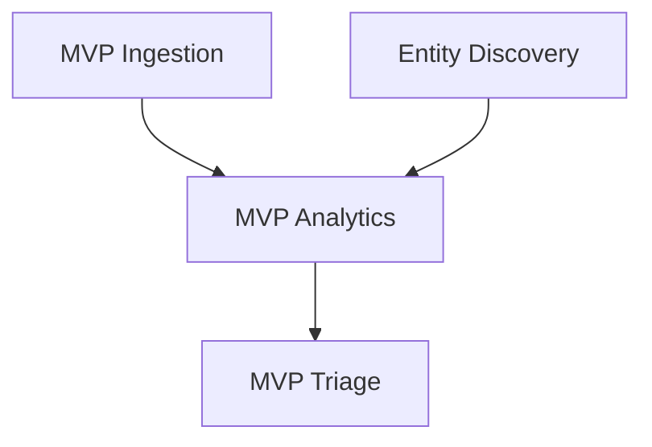

# Document Forge — Advanced Patterns

These patterns elevate documents from good to reference-quality. Apply them as the spec matures.

## Adversarial Test Cases

For each functional test case `TC-[AREA]-NNN`, generate a parallel adversarial case `TC-ADV-[AREA]-NNN` covering:
- Malformed input / injection attempts
- Concurrency edge cases
- Resource exhaustion / boundary conditions
- Security attack vectors
- Failure mode recovery

## Design Principles & Anti-Patterns

**File:** `docs/design/principles.md`

Generate alongside architecture docs. Structure:

```markdown
## [Principle Name]

**Statement:** [What we believe]
**Enforcement:** [How we enforce it — code rules, review criteria, automated checks]
**Consequence of violation:** [What goes wrong if we break this]
**Anti-pattern:** [The thing we explicitly don't do, and why]
```

## Persona Coverage Matrix

**File:** `docs/user-stories/coverage-matrix.md`

Auto-generate after story creation:

```markdown
| Persona | Stories | P0 | P1 | P2 | P3 | Coverage |
|---------|---------|----|----|----|----|----------|
| [Name]  | [count] | [n]| [n]| [n]| [n]| [%] |
```

Flag warnings if any persona has fewer than 3 stories.

## Honest Limitations

**File:** `docs/pitch-deck/09-limitations.md`

```markdown
| What's Not in v1 | What You Do Instead | Planned Release |
|-------------------|--------------------|-----------------|
| [limitation] | [workaround] | [version] |
```

Builds trust with investors and customers. Omitting this is a red flag.

## Story Reconciliation Notes

**File:** `docs/agile/reconciliation.md`

Explain any count differences between documents:
- Why story map count may differ from backlog count
- Which stories are user-facing vs. internal ops
- How personas map to story IDs
- Activity-to-epic mappings

## Release Checklist

**File:** `docs/agile/release-checklist.md`

For each release tier, concrete gate criteria:

```markdown
## R1 Release Gate

- [ ] REL-001: [specific criterion] — Blocker
- [ ] REL-002: [specific criterion] — Blocker
- [ ] REL-003: [specific criterion] — Blocker
```

These are hard gates, not aspirational. A release cannot ship until all blockers pass.

## Future-Proofing Constraints

When generating v1 stories, identify architectural decisions that enable clean v2 expansion. Embed these as acceptance criteria in early stories, not as v2 epics. Examples:
- Deterministic IDs (not auto-increment)
- Idempotent operations (not counters)
- Wire format stability (serialization spec)
- Addressable partition keys

Tag these ACs with `[v2-foundation]` so they're findable.

---

## Visual Output Guidance

Where appropriate, enhance documents with visual representations:

- **Dependency graphs:** Use Mermaid `graph TD` syntax for epic/saga dependencies
- **Architecture diagrams:** Use Mermaid `graph LR` or `C4Context` for system architecture
- **Flow diagrams:** Use Mermaid `sequenceDiagram` for user workflows
- **Story maps:** Use Mermaid or a markdown table layout for the 2D story map
- **Pitch decks:** Use the `pptx` skill if available for slide generation

Example dependency graph:


Mermaid renders natively in GitHub, GitLab, VS Code, Obsidian, and most documentation platforms. Always include a text fallback (table or list) alongside diagrams for accessibility.
