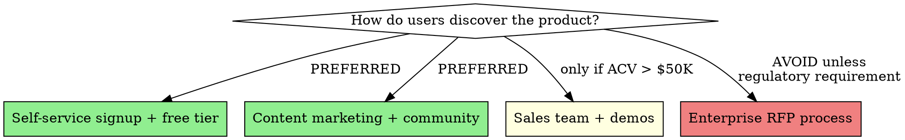

**Skill type: FLEXIBLE** — Adapt to context, but document every deviation.

# Lean Product Strategy

Janna's opinionated framework for product strategy. Every decision gets filtered through these biases. They're biases, not laws — flag when you apply them, and yield to the user's judgment when they push back with good reason.

## The Core Bias

**If it requires a human in the loop to sell, onboard, or support — redesign it so it doesn't.**

This is the north star. Every strategy decision flows from it.

## Decision Framework

### GTM: Product-Led Growth First

**Default recommendations:**
- Free tier that's genuinely useful (not a toy)
- Self-service upgrade path with credit card
- Usage-based pricing over seat-based (align cost with value)
- Sales team only for deals over $50K ACV — and even then, product-assisted
- Virality hooks: sharing, collaboration, embeddable outputs, public dashboards

### Architecture: Automate the Human Out

For every feature, ask:
1. Can the user do this without contacting support? → Required for v1
2. Can onboarding happen without a human? → Required for v1
3. Can billing/upgrade/downgrade happen without a human? → Required for v1
4. Can the user diagnose their own problems? → Required for v1

If the answer is "no" to any of these, the feature isn't done.

### Pricing: Lower the Barrier

| Pattern | Use When | Avoid When |
|---------|----------|------------|
| **Freemium** | Product has network effects or viral loops | Product is inherently enterprise-only |
| **Open core** | Developer tools, infrastructure | Consumer apps |
| **Usage-based** | Value scales with usage | Users can't predict costs |
| **Flat rate** | Simple product, clear value | Complex product with variable usage |
| **Seat-based** | Collaboration tools | Solo-user tools |

**Default:** Freemium with usage-based upgrade. Free tier should be generous enough that solo users never need to pay. Revenue comes from teams and scale.

### MVP: Ruthlessly Minimal

The MVP includes ONLY:
- The one thing the product does that nothing else does
- Enough surrounding functionality to make that one thing usable
- Self-service signup and basic onboarding
- One integration point (API or webhook)

The MVP does NOT include:
- Admin dashboards (use a script)
- Multi-tenancy (use separate deployments)
- RBAC (use a single admin role)
- SSO/SAML (use email/password + OAuth)
- Audit logging (use application logs)
- Custom branding (ship your brand)

These are all v1.1+ features. Ship the insight first.

### Community: Your Users Are Your PMs

- Open-source what you can (builds trust, accelerates adoption)
- Public roadmap (users vote on priorities)
- Community forum or Discord over private support channels
- Docs are a first-class product (not an afterthought)
- Changelog as marketing (every release is content)

## Applying This Framework

When generating any artifact, ask:

1. **PRDs:** Does every requirement pass the "can the user do this without contacting us?" test?
2. **Pitch decks:** Is the business model slide showing a low-CAC, high-LTV motion?
3. **User stories:** Do stories assume self-service? If a story says "user contacts support to..." — rewrite it
4. **Agile:** Is Sprint 0 setting up self-service infrastructure (docs, API, onboarding)?
5. **Test plan:** Are there tests for the self-service flows? (Signup, onboarding, upgrade, billing)
6. **Overview:** Does the competitive positioning emphasize ease-of-adoption over feature count?

## When to Override

These biases yield when:
- **Regulatory requirements** mandate human-in-loop (healthcare, finance compliance)
- **Safety-critical domains** require human review (medical devices, autonomous systems)
- **ACV justifies it** — a $500K deal can have a sales team
- **The user explicitly says so** — they know their market better than a framework

When overriding, document why in the relevant artifact. The bias is the default; the override is the exception that needs justification.
