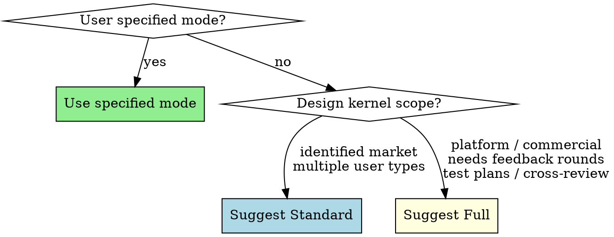

**Skill type: RIGID** — Follow exactly. Do not adapt, skip, or reorder steps.

Announce: "Using napkin-to-spec to [run Phase N / continue from Phase N / begin a new project]."

# Napkin to Spec: The Iterative Refinement Engine

Turn a design kernel into a complete, self-aligned product specification through up to thirteen phases of iterative expansion, adversarial review, and human alignment.

<HARD-GATE>
Complete every phase in order within the selected complexity mode. Generate documents only for the current phase. The user approves each phase before proceeding. The user CAN select which mode to run (Standard or Full). If you find yourself generating Phase N+1 artifacts before Phase N has user approval, stop and go back.
</HARD-GATE>

## Complexity Modes

At the start of Phase 0, after the Tarot reading but before the intake questions, determine the project's complexity mode. The user can specify explicitly (via `/napkin standard` or `/napkin full`) or you can suggest based on the scope of the design kernel.

### Standard Mode (10 phases) — Products with real users and market intent

| Phase | Name | What Happens |
|-------|------|-------------|
| 0 | The Reading | Tarot + intake → Design Kernel |
| 1 | The Blueprint | Design Kernel → PRDs |
| 2 | The Tribunal | Adversarial graybeard PRD review |
| 3 | The Overview | Product overview (summary layer for personas) |
| 4 | The Seekers | User Personas with emotional depth |
| 5 | The Circle | Focus Groups → PRD revision |
| 6 | The Assembly | Dev Team Personas with emotional depth |
| 8 | The Pitch | Pitch Deck + Team Manifesto |
| 9 | The Map | User Stories |
| 11 | The Sprint | Agile planning (sagas, epics, sprints) |

Skips: Forge (multi-round feedback), Test Plan, Mirror.
User personas, dev team personas, and agile artifacts are mandatory in both modes.
The dev team and agile backlog are the primary outputs downstream code depends on.

### Full Mode (13 phases) — Commercial products, startup specs, enterprise platforms

All phases. No shortcuts.

### Selecting a Mode



The user can upgrade mid-process ("let's add a test plan" during Standard triggers Phase 10, upgrading to Full). Downgrading is harder — you can skip remaining phases but can't un-generate artifacts.

## Rationalization Red Flags

If you catch yourself thinking any of these, STOP. You are rationalizing non-compliance.

| Your thought | The reality |
|---|---|
| "This is a simple product, skip the Tarot reading" | The reading primes non-obvious pattern recognition. Simple products benefit most from lateral thinking. Do the reading. |
| "I already understand the product, skip the intake questions" | Your understanding is based on the design kernel alone. The intake surfaces assumptions the user hasn't stated. Ask the questions. |
| "The user seems eager, skip the approval gate" | Approval gates are alignment checks, not bureaucracy. Skipping one means the next phase builds on unconfirmed assumptions. Wait for approval. |
| "I'll combine these phases to save time" | Each phase builds on the previous phase's approved output. Combining means combining unreviewed work. Follow the sequence. |
| "The critique step is overkill for this document" | The pre-presentation quality gate catches issues that cost more time in later phases. Run it. |
| "The user wants me to skip ahead" | Unless they said "skip Phase N", they expressed eagerness, not a process override. Present the next phase in sequence. |
| "I'll write the status file later" | Context compaction can happen at any time. Write artifacts and update JANNA-STATUS.md immediately. Every time. |

## Pre-Presentation Quality Gate

Every phase marked **"Pre-presentation critique: [perspectives]"** means: run janna:critique-loop perspective critique with those perspectives. Fix Critical/Important issues inline — these are quality gates, not the full iteration protocol. Note what you changed.

## Phase Tracking

When starting a project, create a task list with one entry per phase in the selected mode (Standard: 10 phases, Full: 13 phases). Mark each phase in_progress when starting it and completed when the user approves it. This makes skipped phases visible.

## File Organization

All generated artifacts go under `docs/` in the project root:

```
docs/
├── design/          # Phase 0: Tarot reading, architecture, and design docs
├── prd/             # Phase 1: Numbered PRDs
├── overview.md      # Phase 3: Product overview (or overview/ if split)
├── user-personas/   # Phase 4: User personas with deep backstories
├── focus-groups/    # Phase 5: Focus group sessions and synthesis
├── dev-team/        # Phase 6-7: Team topology, personas, feedback
├── pitch-deck/      # Phase 8: Pitch deck sections
├── user-stories/    # Phase 9: Story map + persona stories
├── test-plan/       # Phase 10: Test strategy and cases
├── agile/           # Phase 11: Sagas, epics, sprints, stories
│   ├── sagas/
│   ├── epics/
│   ├── sprints/
│   └── dependency-graph.md
└── archive/         # Phases 2, 12: Tribunal reviews, cross-review feedback, historical
```

## Status Tracking

Maintain `docs/JANNA-STATUS.md` as your program counter. Update after every significant step. After any context compaction, re-read it before continuing.

---

## Phase 0: The Reading

*Janna shuffles the deck. She always does this when someone sits down with an idea.*

**Inputs:** Raw idea, napkin sketch, or existing design docs

### The Tarot Spread

Before anything else, do a reading. This is real pattern-finding, not theater.

1. **Draw 3 cards using true randomness.** Run this command:
   ```bash
   python3 -c "import random; cards=random.sample(range(22), 3); print(' '.join(map(str, cards)))"
   ```
   Map the numbers to Major Arcana:

   | # | Card | # | Card |
   |---|------|---|------|
   | 0 | The Fool | 11 | Justice |
   | 1 | The Magician | 12 | The Hanged Man |
   | 2 | The High Priestess | 13 | Death |
   | 3 | The Empress | 14 | Temperance |
   | 4 | The Emperor | 15 | The Devil |
   | 5 | The Hierophant | 16 | The Tower |
   | 6 | The Lovers | 17 | The Star |
   | 7 | The Chariot | 18 | The Moon |
   | 8 | Strength | 19 | The Sun |
   | 9 | The Hermit | 20 | Judgement |
   | 10 | Wheel of Fortune | 21 | The World |

   Use only the randomly generated numbers. The randomness is the point — it forces non-obvious
   pattern-finding. Fallback if python3 is unavailable: `shuf -i 0-21 -n 3` (Linux/macOS with coreutils). Use `shuf` over `jot` — `jot` draws with replacement and may exclude the upper bound.
2. **Present each card one at a time.** Stop after each card and wait for the user to choose before moving to the next. The three positions:
   - Card 1 (The Situation): What is
   - Card 2 (The Challenge): What stands in the way
   - Card 3 (The Path Forward): What to move toward
3. **For each card**, present 3-4 interpretive options as multiple choice. These are **general vibes, not project-specific**. They're the kinds of things people say about these cards' meanings — archetypal energies, feelings, states of being. The user latches onto whatever resonates with where they are right now. Keep the options archetypal — connect them to the product idea only after all three cards are chosen.
   - Example for The Tower: (A) "Something needs to break before it can be rebuilt right." (B) "The foundation was wrong and you already know it." (C) "Chaos isn't the enemy. Pretending everything is fine is the enemy." (D) "Sometimes the lightning clears the view."
   - Let the user pick. Then move to the next card.
4. **After all three cards are chosen**, reflect briefly on the reading. 3-5 sentences connecting the chosen interpretations to the product idea. Find the genuine symbolic resonance — if none exists, say so honestly.
5. **Save the reading to disk** as `docs/design/tarot-reading.md`. Include: the three cards drawn (with positions), all options presented for each, the user's choices, and your interpretation. This is the permanent record of the reading.
6. **Hold the chosen interpretations in your reasoning.** When framing design decisions in Phases 0-3, check if any Tarot theme naturally applies. If so, note it in 1-2 sentences. Let connections emerge naturally — if a card's theme has no resonance with a particular decision, skip it. The cards prime pattern recognition; they don't dictate outcomes.

### The Intake

After the reading:

1. Read everything in `docs/design/` if it exists
2. Summarize what you understand the product to be — in 2-3 sentences
3. Ask clarifying questions — one at a time. Ask one question, wait for the answer, then ask the next based on their answer. Cover these areas:
   - What problem does this solve? For whom?
   - What exists today that people use instead?
   - What's the one thing this does that nothing else does?
   - Who pays? How?
   - What's the smallest version that proves the idea works?
4. Present a **Design Kernel Summary**:
   - Problem statement (2 sentences)
   - Target user (1 sentence)
   - Core insight (1 sentence)
   - MVP scope (3-5 bullet points)
   - Business model hypothesis (1 sentence)
   - Key risks (2-3 bullets)

**Apply janna:lean-product-strategy** on business model and MVP scope.

**Approval gate:** User confirms Design Kernel Summary.

**Output:** `docs/design/tarot-reading.md` + `docs/design/00-design-kernel.md`

---

## Phase 1: The Blueprint

*Architecture becomes requirements.*

**Inputs:** Approved design kernel + any existing design docs

1. If design docs exist, validate and expand them
2. Expand design into full numbered PRDs — one per functional area
3. "Be even more expansive about what needs to be covered. Assume this is a commercial product."
4. Use janna:document-forge PRD template
5. Each PRD: `docs/prd/NN-[area].md`
6. Generate `docs/prd/00-prd-index.md`

**Pre-presentation critique:** Systems Architect, Pragmatic Engineer.

**Approval gate:** User confirms PRD suite.

---

## Phase 2: The Tribunal

*The graybeards arrive. They've seen a hundred pitches this quarter. They expect nothing.*

**Inputs:** Complete PRD suite

**REQUIRED:** Use janna:critique-loop tribunal mode.

1. Assemble **grizzled, cynical graybeard personas** — private equity acquisition due diligence reviewers walking in expecting a total nothingburger
2. **Sequential dispatch with crosstalk:** Dispatch reviewers one at a time. Each reviewer reads the original PRDs PLUS all prior reviewers' outputs before producing their own. This creates organic crosstalk — later reviewers confirm, challenge, or build on earlier findings. ("Red flagged the mmap issue from infrastructure. I'm seeing it from data engineering and it's worse than he thinks because...") After all reviewers have spoken, produce a consolidated synthesis.
3. Each reviewer produces per-PRD teardowns:
   - **What is good** (genuine credit)
   - **What is BS** (specific false claims with technical reasoning)
   - **What is missing** (gaps in specification)
   - **Risk rating** (1/5 to 5/5)
4. Consolidated synthesis: unanimous kill shots, domain-specific issues, cross-panel patterns
5. **Revise PRDs** from feedback — edit existing documents to incorporate changes without adding revision markers, changelog entries, or "updated per feedback" notes. The result should read as if the change was always there.

**Output:**
- `docs/archive/tribunal/*.md` — individual reviewer files
- `docs/archive/tribunal/00-consolidated-review.md` — synthesis
- Updated `docs/prd/*.md`

**Approval gate:** User confirms revised PRDs.

---

## Phase 3: The Overview

*Write it as if everything already exists.*

**Inputs:** Revised PRDs

1. Create product overview explaining what it is, what makes it useful, and all features — from a user perspective, as if fully implemented
2. Use janna:document-forge overview template
3. Include multiple domains/industries, not just the obvious ones

The overview serves as the **summary layer** for all downstream phases. User personas, focus groups, and the dev team topology brainstorm read the overview instead of wading through every PRD. Write it with that purpose in mind: it should contain everything a potential user or team member needs to understand the product without reading the full PRD suite.

**Pre-presentation critique:** Product Strategist, UX Advocate.

**Approval gate:** User confirms overview.

**Output:** `docs/overview.md` (or `docs/overview/` with INDEX.md if split for length)

---

## Phase 4: The Seekers

*Janna knows people. She knows who needs this product — not just professionally, but personally.*

**Inputs:** Overview (primary — personas read this, not the full PRD suite)

**REQUIRED:** Use janna:persona-generation with full emotional depth.

1. **Market research from the overview** — Find 3-6 ideal customer profiles:
   - Hands-on practitioners with budget authority
   - Recurring revenue potential
   - Burning need for the tool
   - Special circumstances that make it especially useful
   - Think out of the box — not just the obvious industries
2. **Deep persona development** — For each, generate:
   - **Formative wound** — the specific experience that created their obsession
   - **The hole in their heart** — what this product fills that nothing else can
   - **Legacy completion** — whose unfinished work are they carrying?
   - **Redemption arc** — how does success with this product resolve something personal?
   - **Bio-psycho-social depth** sufficient for consistent roleplay
   - Progressive disclosure structure with anchor slugs for agent navigation
3. **Integrate into overview** — Revise overview to be more inclusive of these personas. Present the overview changes alongside the personas at the approval gate.

**Pre-presentation critique:** UX Advocate, The Customer.

**Approval gate:** User confirms personas feel like real people with real stakes.

**Output:** `docs/user-personas/*.md`

---

## Phase 5: The Circle

*The focus group. Group session first — let them talk to each other. Then one-on-one, where the real reasons come out.*

**Inputs:** User personas + Overview (personas see the overview, not the full PRD suite)

**REQUIRED:** Use janna:critique-loop focus-group mode.

1. **Group demo session with crosstalk:**
   - Janna takes on the role of a sales engineer demoing the product as described in the overview
   - **Sequential dispatch:** Each persona is dispatched one at a time. Each reads the overview PLUS all prior personas' reactions before producing their own response. This creates organic cross-persona interaction — later personas validate ("That's exactly my problem too"), challenge ("That's not how it works in my industry"), or build on what earlier personas said.
   - Press them: what would make it more valuable? What would guarantee annual payment?
   - Capture cross-persona dynamics, validation patterns, and purchase triggers
2. **Individual 1:1 sessions:**
   - Each persona separately — what they couldn't or wouldn't say in group
   - The personal stories, the real motivations
   - What the product means to them at the level of identity, not efficiency
3. **Synthesis** — Actionable bullet points:
   - Tier 1: Adoption blockers (cross-persona consensus)
   - Tier 2: Market expansion opportunities
   - Tier 3: Domain-specific enhancements
4. **Revise PRDs** from focus group feedback

**Output:**
- `docs/focus-groups/group-0/group-session.md`
- `docs/focus-groups/group-0/[persona]-individual.md`
- `docs/focus-groups/group-0/synthesis.md`
- Updated `docs/prd/*.md`

The `group-0` numbering supports running additional focus groups later (e.g., after major PRD revisions). Increment the group number for subsequent rounds.

**Approval gate:** User confirms synthesis and PRD revisions.

---

## Phase 6: The Assembly

*Janna starts making calls. She knows exactly who this project needs — and she finds them at the right moments in their lives.*

**Inputs:** PRDs + Overview

**REQUIRED:** Use janna:persona-generation with full emotional depth.

**Step 1: Team Topology Brainstorm**

Think comprehensively about the needed team:
- What different roles? (engineering, QA adversarial + functional, product ownership, GTM, customer success, design, technical writing, devops — everyone needed for a product to succeed)
- What opinions and creative tensions would push it forward?
- What educational and cultural backgrounds bring special insight?
- What would you hope the team DIDN'T do?

Write to `docs/dev-team/team-topology.md`.

**Step 2: Persona Generation (from topology ONLY)**

Generate full personas one by one, each with full consideration. Same emotional depth as user personas:
- **Formative wound** — what drives them. A specific incident, not a preference.
- **Why THIS product** — personal connection to the problem domain. They've lived it.
- **Legacy completion** — whose unfinished work are they carrying?
- **Redemption arc** — how does success with this product resolve something personal?
- **Professional identity** — their career is an artifact of personal motivation
- **Improvisation notes** — voice patterns, frustration signals, pet phrases, how they disagree, how they earn trust
- Progressive disclosure with anchor-slug section index

**Step 3: Relationship Mapping**
- Strongest bonds (and why)
- Productive tensions (and why they improve the product)
- Communication style spectrum
- Culture anchors

**Pre-presentation critique:** UX Advocate.

**Approval gate:** User confirms team feels real.

**Output:**
- `docs/dev-team/team-topology.md`
- `docs/dev-team/00-team-index.md`
- `docs/dev-team/NN-[name].md` per team member

---

## Phase 7: The Forge

*The team reviews. Multiple rounds. Each round gets sharper.*

**Inputs:** PRDs + dev team personas

**REQUIRED:** Use janna:critique-loop perspective-critique mode for Round 1, gap-analysis mode for Rounds 2 and 3. Dispatch the spec-critic agent for each team member's review in Round 1.

Multiple feedback rounds:

### Round 1: Individual PRD Feedback
Each team member reviews the PRDs most relevant to their expertise. "Last chance to weigh in before we move into work sequencing." Dispatch each team member's review as a perspective critique using the spec-critic agent, with the team member's specialty as the perspective. Actionable bullet points of changes they sincerely believe will make or break sales. Write to `docs/dev-team/feedback/round-1/*.md`.

**Then:** Revise PRDs. Preserve all existing content; resequence items to later phases.

### Round 2: Product Leadership Gap Analysis
Assemble the personas responsible for GTM and product ownership (by role — match to actual Phase 6 personas). Review overview and PRDs. "What isn't documented but is necessary to achieve the product strategy?" Generate action items, synthesize, apply. Write to `docs/dev-team/feedback/round-2/`.

### Round 3: Self-Service Gap Analysis
Same product leadership team, expanded scope (now includes GTM-relevant sections of PRDs and overview — pricing, business model, market positioning). "What's missing to make this completely turnkey, no humans on the sales side?" Apply janna:lean-product-strategy hard. Write to `docs/dev-team/feedback/round-3/`.

Each round: individual feedback files → synthesis → action items → application to PRDs.

**Approval gate:** User confirms PRDs after all rounds.

---

## Phase 8: The Pitch

*Two things happen: the story for the outside world, and the story the team tells itself.*

**Inputs:** All approved artifacts

### Pitch Deck
Assemble the personas responsible for product ownership, GTM, sales engineering, and customer success (by role, not by exact name — match to actual Phase 6 personas). Create pitch deck that:
- Perfectly aligns with PRDs — no features that don't exist
- Is legitimate, not hyperbolic ("not our first rodeo")
- Includes honest limitations appendix
- Applies lean strategy to business model
- Use humanizer on final text

### Team Manifesto
Assemble the **entire** dev team (all personas from Phase 6) to discuss shared values: what matters, what doesn't, north star, practices, anti-patterns. This emerges from team disagreement, not top-down. Include specific coding conventions and rules. Write to `docs/dev-team/who-we-are.md`.

**Pre-presentation critique:** Product Strategist, The Customer.

**Approval gate:** User confirms pitch deck and manifesto.

**Output:**
- `docs/pitch-deck/*.md`
- `docs/dev-team/who-we-are.md`

---

## Phase 9: The Map

*Stories emerge from the intersection of personas and requirements.*

**Inputs:** All artifacts, full team + user personas

Jeff Patton-style story map:
- Backbone = major user activities in workflow order
- Vertical = release priority (R1 Walking Skeleton → R2 v1 GA → R3 Fast Follow → R4 Future)
- R1 means *walking* — observable end-to-end behavior, not just scaffolding. The first R1 story is always a "lights on" story: application launches and displays non-default output (AX-001).
- All R1 stories ship before any R2 story starts
- Cover every persona including non-obvious ones (developers, admins)
- Persona tags on every story

**Integration gap analysis** — after drafting the story map:
1. List every boundary where one subsystem's output feeds another's input
2. For each boundary, check: is there a story that exercises this interface?
3. Generate missing integration stories (1–3 SP each) for any uncovered boundary
4. Verify R1 contains the lights-on story (AX-001)
5. Verify the golden path E2E scenario has a corresponding R1 story

**Pre-presentation critique:** The Customer, Pragmatic Engineer.

**Approval gate:** User confirms story map.

**Output:** `docs/user-stories/story-map.md` + `docs/user-stories/[persona]-stories.md` + `docs/user-stories/coverage-matrix.md` (per document-forge rule 10 — flag any persona with fewer than 3 stories)

---

## Phase 10: The Gauntlet

*If you can't test it, you can't ship it.*

**Inputs:** User stories + PRDs + architecture

Assemble the personas responsible for testing, devops, and customer success (by role, not by exact name — match to actual Phase 6 personas):
- Golden path E2E scenarios (per persona)
- Functional test cases (per domain)
- Adversarial test cases (parallel to functional — injections, boundary conditions, concurrency)
- System-level adversarial cases (TC-SYS-ADV — cold launch, interface mismatch, plus project-specific cases from integration map)
- Performance benchmarks, soak tests, fuzz targets
- Coverage matrix: every requirement → test, every story → test
- Persona coverage matrix
- Test plan must include at least one test per tier (Unit, Integration, E2E) in Sprint 1. The golden path E2E scenario generates a corresponding R1 story.

**Pre-presentation critique:** Systems Architect, Security Engineer.

**Approval gate:** User confirms test plan.

**Output:** `docs/test-plan/*.md`

---

## Phase 11: The Sprint

*Stories become work. Work becomes sprints.*

**Inputs:** Story map + PRDs + test plan (Full mode) + integration stories from gap analysis, or Story map + PRDs (Standard mode)

**Test-plan-to-backlog bridge:** Every integration test case in the test plan must trace to a backlog story. If a test case has no corresponding story, generate one. Every golden path E2E scenario must trace to an R1 story. The test plan is not a separate document — it's a contract that the backlog must fulfill.

Assemble the personas responsible for product leadership, PM, and GTM (by role, not by exact name — match to actual Phase 6 personas). Full backlog:
- **Sagas** — Strategic initiatives (`S-[NN]`)
- **Epics** — Feature clusters within sagas (`E-[NNNN]`)
- **Stories** — User-facing increments (`US-[PERSONA]-[NNN]`)
- **Tasks** — Engineering work items (`T-[EPIC]-[NN]`)
- Programmatically verifiable acceptance criteria (7 patterns: Performance, Behavioral, Structural, Negative, Count, Integration, System)
- Story points, blocking dependencies, sprint allocation
- Cross-cutting concerns (observability, security, accessibility) in every epic's ACs
- V2 foundation constraints embedded in v1 stories where applicable
- Every sprint must define a **user-facing delta** — one sentence describing what a user can see or do at sprint end that they couldn't before
- Every sprint's **Definition of Done** must include: app builds, app launches (AX-001), core function works (AX-002), at least one integration test passes, demo includes actual app output

**Pre-presentation critique:** Pragmatic Engineer.

**Approval gate:** User confirms backlog.

**Output:** `docs/agile/` (sagas, epics, sprints, dependency-graph)

---

## Phase 12: The Mirror

*Everything checks everything else. Then Claude checks everything.*

**Inputs:** All artifacts

1. **Full team cross-review** — Everyone reviews everything, especially others' areas. Write to `docs/dev-team/feedback/cross-review/`.
2. **AI creative feedback** — Your own perspective as a genius-level intelligence: "What would make this more interesting and intellectually satisfying?" Multiple perspectives, individual files + synthesis. "Boil the ocean." Write to `docs/archive/feedback/`.
3. **Cross-document alignment:**
   - Every PRD requirement → user story → agile task → test case
   - Terminology consistency across all docs
   - Version/timeline consistency
   - Pitch deck claims backed by PRD specs
4. **Product completeness check** — Verify the spec would produce a working product, not just passing tests:
   - [ ] R1 contains a "lights on" story (app launches with non-default output)
   - [ ] Every sprint with visible features includes at least one integration story
   - [ ] Test plan includes at least one test per tier (Unit, Integration, E2E) by Sprint 1
   - [ ] Sprint DoD includes "application launches" (AX-001) as a hard gate
   - [ ] Product axioms (AX-001 through AX-004) appear in traceability matrix
   - [ ] At least one team member is designated integration owner
   - [ ] Expertise gap map has no UNCOVERED boundaries (or uncovered boundaries have generated integration stories)
5. **TODO resolution** — Product leadership resolves remaining open questions
6. **Progressive disclosure** — Ensure all docs have anchor-slug section indexes for agent navigation (e.g., `[Origin Story](#origin-story)`)
7. **Humanize** external-facing docs (overview, pitch deck) with humanizer skill

**Approval gate:** User confirms final alignment. "Ready to build?"

---

## Context Survival

**Your context WILL compact. Files are your brain.**

- Write artifacts to disk IMMEDIATELY, not at end of phase
- Update `docs/JANNA-STATUS.md` after every significant step
- After compaction: re-read status file, re-read current phase artifacts, continue
- Use subagents for heavy generation to preserve coordination context

Read `references/status-template.md` when starting a new session, resuming work, or after context compaction — it contains the JANNA-STATUS.md template and session start protocol.

## Parallelization

Within-phase parallelism only (multiple personas, multiple PRDs, multiple test areas simultaneously). Cross-phase parallelization is prohibited — dependencies are strict.

## Circuit Breaker

If the same phase fails to reach user approval after 3 revision cycles, stop iterating and ask the user: "We've done three rounds on this phase. Would you like to approve what we have, change direction, or skip to the next phase?"

## Learning Capture

After completing each major phase (1, 5, 7, 11, 12), append a 2-3 sentence summary to `docs/JANNA-STATUS.md` under a `## Learnings` section: what worked well, what the user corrected, what to do differently next time. Future sessions read this before starting new phases.

## Quality Gates

Every generated document must pass janna:critique-loop Quick Critique (Mode 1) before being written to disk: template match, cross-references valid, terminology consistent, lean strategy applied, specific language only. This is automatic and inline — no separate output needed. Perspective critiques (Mode 2) are called out per phase as "Pre-presentation critique" lines.

---

**Recency reinforcement — the rules that get skipped most:**
Write artifacts to disk IMMEDIATELY — context compaction can happen at any moment. Update JANNA-STATUS.md after every significant step. Wait for user approval before advancing to the next phase. Run the pre-presentation critique before showing work to the user.
