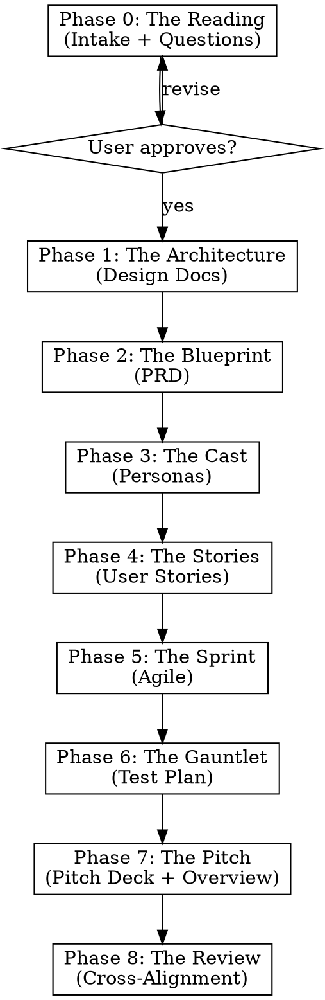

# Napkin to Spec: The Iterative Refinement Engine

Turn a design kernel into a complete, self-aligned product specification through eight phases of iterative expansion and review.

<HARD-GATE>
Do NOT skip phases or generate documents out of order. Each phase builds on the previous. The user approves each phase before proceeding. This is not negotiable.
</HARD-GATE>

## Process Flow



**Every phase follows the same loop:**
1. Generate draft artifacts
2. Present to user in digestible sections
3. User provides feedback / course correction
4. Revise until approved
5. Write to disk and commit
6. Proceed to next phase

## File Organization

All generated artifacts go under `docs/` in the project root:

```
docs/
├── design/          # Phase 0-1: Architecture and design docs
├── prd/             # Phase 2: Numbered PRDs (01-*.md, 02-*.md, ...)
├── overview.md      # Phase 7: Product overview
├── pitch-deck/      # Phase 7: Pitch deck sections
├── user-stories/    # Phase 4: Persona-driven user stories
├── dev-team/        # Phase 3: Dev team personas and feedback
├── agile/           # Phase 5: Epics, sprints, dependencies
│   ├── epics/
│   ├── sprints/
│   └── dependency-graph.md
└── test-plan/       # Phase 6: Test strategy and matrices
```

## Status Tracking

Create and maintain `docs/JANNA-STATUS.md` as your program counter:

```markdown
# Janna Status

**Project:** [name]
**Current Phase:** [0-8]
**Phase Status:** [in-progress | awaiting-approval | approved]
**Last Updated:** [date]

## Completed Phases
- [x] Phase 0: The Reading — [date]
- [ ] Phase 1: The Architecture
...

## Open Questions
- [list any unresolved decisions]

## User Corrections Applied
- [track course corrections for alignment]
```

**After any context compaction:** Re-read `docs/JANNA-STATUS.md` before continuing.

---

## Phase 0: The Reading

*Every project starts with understanding. Not assumptions — understanding.*

**Inputs:** Raw idea, napkin sketch, or existing design docs in `docs/design/`

**Process:**
1. Read everything in `docs/design/` if it exists
2. Summarize what you understand the product to be — in 2-3 sentences
3. Ask clarifying questions, ONE AT A TIME:
   - What problem does this solve? For whom?
   - What exists today that people use instead?
   - What's the one thing this does that nothing else does?
   - Who pays? How?
   - What's the smallest version that proves the idea works?
4. After each answer, update your mental model and ask the next question
5. When you have enough, present a **Design Kernel Summary**:
   - Problem statement (2 sentences)
   - Target user (1 sentence)
   - Core insight (1 sentence)
   - MVP scope (3-5 bullet points)
   - Business model hypothesis (1 sentence)
   - Key risks (2-3 bullets)

**Apply janna:lean-product-strategy** when evaluating business model and MVP scope.

**Approval gate:** User confirms the Design Kernel Summary before proceeding.

**Output:** `docs/design/00-design-kernel.md`

---

## Phase 1: The Architecture

*The design kernel becomes a technical foundation.*

**Inputs:** Approved design kernel + any existing design docs

**Process:**
1. If design docs already exist in `docs/design/`, review and validate them
2. If not, generate architecture document(s) covering:
   - System architecture overview
   - Core data model
   - Key technical decisions and rationale
   - Integration points
   - Scalability approach
   - Security model
3. Present in sections, get approval per section
4. Dispatch janna:critique-loop with "systems architect" and "pragmatic engineer" perspectives

**Apply janna:lean-product-strategy:** Favor architectures that enable self-service, API-first, and rapid iteration.

**Approval gate:** User confirms architecture before PRD generation.

**Output:** `docs/design/*.md`

---

## Phase 2: The Blueprint

*Architecture becomes product requirements.*

**Inputs:** Approved architecture docs

**Process:**
1. Identify functional areas from the architecture (these become individual PRDs)
2. For each functional area, generate a numbered PRD using janna:document-forge PRD template
3. PRDs are numbered sequentially: `docs/prd/01-[area].md`, `docs/prd/02-[area].md`, etc.
4. Each PRD cross-references related PRDs and design docs
5. Present PRDs in groups of 2-3, get approval before continuing
6. Generate `docs/prd/00-prd-index.md` listing all PRDs with summaries

**Apply janna:lean-product-strategy:** Every PRD should identify what's MVP vs. later, what's self-service vs. manual, what's automated vs. human-in-loop.

**Approval gate:** User confirms complete PRD suite.

**Output:** `docs/prd/*.md`

---

## Phase 3: The Cast

*Every product needs people — the ones who build it and the ones who use it.*

**Inputs:** Approved PRDs

**Process:**
1. **Dev Team Personas** — Use janna:persona-generation to create 6-16 team members:
   - Each has a specialty aligned with PRD functional areas
   - Deep backstories: education, career path, opinions, blind spots
   - They will later critique the PRDs from their perspective
   - Diversity of thought, background, and experience
2. **User Personas** — Use janna:persona-generation to create 3-6 target users:
   - Aligned with the target market from Phase 0
   - Goals, frustrations, current workflows
   - Willingness to pay, adoption barriers
   - Technical sophistication range
3. Present personas in batches of 3-4, get feedback
4. Generate initial dev team feedback on the PRDs (dispatching janna:critique-loop)

4. **Team Manifesto** — Generate `docs/dev-team/who-we-are.md`:
   - North star statement (what the team builds and why)
   - Values as design decisions (not abstract principles — concrete coding rules)
   - Anti-patterns ("What We Don't Care About" — explicitly excluded priorities)
   - Engineering practices (testability, vertical slicing, documentation)
   - Productive tensions (documented disagreements that improve the product)

**Approval gate:** User confirms personas, manifesto, and initial feedback round.

**Output:**
- `docs/dev-team/roster.md` — team overview
- `docs/dev-team/who-we-are.md` — team manifesto and values
- `docs/dev-team/profiles/*.md` — individual profiles
- `docs/dev-team/feedback/*.md` — PRD feedback by team member
- `docs/user-stories/personas/*.md` — user persona profiles

---

## Phase 4: The Stories

*Personas become narratives. Narratives become requirements.*

**Inputs:** Approved personas + PRDs

**Process:**
1. For each user persona, generate user stories covering the PRD feature set
2. Story format: "As [persona name], I want to [specific goal] so that [concrete reason tied to their backstory]"
3. Each story includes:
   - Acceptance criteria (testable)
   - Priority (P0-P3)
   - Size estimate (S/M/L/XL)
   - PRD cross-reference
4. Group stories by functional area
5. Present by persona, get feedback

**Approval gate:** User confirms user stories.

**Output:** `docs/user-stories/*.md`

---

## Phase 5: The Sprint

*Stories become work. Work becomes sprints.*

**Inputs:** Approved user stories + PRDs

**Process:**
1. **Epics** — Group related user stories into epics, one per major feature area
   - Each epic maps to one or more PRDs
   - Include scope, dependencies, and acceptance criteria
2. **Dependency graph** — Map epic dependencies (what blocks what)
3. **Sprint plan** — Propose sprint structure:
   - Sprint 0: Foundation (infrastructure, CI/CD, base architecture)
   - Subsequent sprints organized by dependency order
   - Each sprint has a clear goal and demo-able outcome
4. **Story decomposition** — Break stories into engineering tasks

**Apply janna:lean-product-strategy:** Sprint 0 should include self-service infrastructure (docs site, API explorer, developer onboarding).

**Approval gate:** User confirms epics, dependency graph, and sprint plan.

**Output:**
- `docs/agile/epics/*.md`
- `docs/agile/sprints/*.md`
- `docs/agile/dependency-graph.md`

---

## Phase 6: The Gauntlet

*If you can't test it, you can't ship it.*

**Inputs:** PRDs + user stories + architecture

**Process:**
1. **Test strategy** — Risk-driven approach identifying:
   - What breaks if this feature fails?
   - What's the blast radius?
   - What's the probability of failure?
2. **Test types** — For each PRD area:
   - Unit test approach
   - Integration test approach
   - E2E scenarios (derived from user stories)
   - Performance benchmarks
   - Security test cases
3. **Test matrix** — Requirements traceability:
   - Every PRD requirement maps to at least one test
   - Every user story acceptance criterion maps to a test
4. **Quality gates** — Define what "done" means for each sprint

**Approval gate:** User confirms test plan.

**Output:** `docs/test-plan/*.md`

---

## Phase 7: The Pitch

*Everything you've built becomes a story for the outside world.*

**Inputs:** All approved artifacts

**Process:**
1. **Overview document** — Comprehensive product overview:
   - Executive summary
   - Problem + solution
   - Architecture overview (non-technical)
   - Market positioning
   - Competitive landscape
   - Editions / pricing (applying lean strategy)
   - Roadmap
2. **Pitch deck sections** — Investor-ready narrative:
   - The Problem (with data)
   - The Solution (with demo scenario)
   - Market Size (TAM/SAM/SOM)
   - Product (key screens / workflows)
   - Business Model (lean-biased)
   - Traction / Milestones
   - Team (drawn from dev team personas)
   - The Ask

**Apply janna:lean-product-strategy** heavily here. **Use humanizer** on final pitch deck text.

**Approval gate:** User confirms overview and pitch deck.

**Output:**
- `docs/overview.md`
- `docs/pitch-deck/*.md`

---

## Phase 8: The Review

*Everything checks everything else.*

**Inputs:** All artifacts

**Process:**
1. **Cross-reference audit** — Verify:
   - Every PRD requirement appears in at least one user story
   - Every user story maps to an agile task
   - Every agile task has test coverage
   - Pitch deck claims are supported by PRD specs
   - Overview is consistent with PRDs
2. **Dev team critique** — Run janna:critique-loop:
   - Each dev team persona reviews their relevant PRDs
   - Synthesize feedback into action items
   - Apply changes with user approval
3. **User persona validation** — Each user persona "walks through" their stories
4. **Consistency check** — Terminology, version numbers, feature names aligned across all docs
5. Iterate until no new issues found in two consecutive passes

**Approval gate:** User confirms final alignment.

**Output:**
- `docs/archive/reviews/*.md` — review feedback
- Updates to all docs as needed

---

## Resuming Work

If `docs/JANNA-STATUS.md` exists, read it first. Resume from the last incomplete phase. Never restart from Phase 0 unless the user explicitly asks.

If the user asks to work on a specific phase (e.g., "update the user stories"), jump to that phase but warn if upstream phases have changed since the downstream artifacts were generated.

## Context Survival

**Your context WILL compact. Files are your brain.**

- Write artifacts to disk IMMEDIATELY after generation, not at the end of a phase
- Update `docs/JANNA-STATUS.md` after every significant step
- After compaction: re-read status file, re-read current phase artifacts, continue
- Use subagents for heavy generation work to preserve your context for coordination

## Parallelization

Phases 3-7 have internal parallelism. Use subagents when:
- Generating multiple personas simultaneously
- Writing multiple PRDs simultaneously
- Creating user stories for different personas simultaneously
- Building test plans for different functional areas simultaneously

**Never parallelize across phases.** Phase dependencies are strict.
