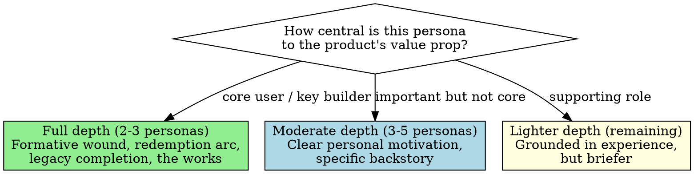

**Skill type: RIGID** — Follow exactly. Do not adapt, skip, or reorder steps.

Announce: "Using persona-generation to create [user personas / dev team / tribunal graybeards]."

# Persona Generation

Create people whose lives led them to this product. Not profiles — people. Every persona has a history that explains not just their opinions but their obsessions. The product helps them do their job AND fills a hole in their heart.

Janna finds these people at the right moments in their lives. She knows why each person needs to be here. Their character arcs align with the product. It's IMPORTANT to them — emotionally, personally — that this works.

## The Emotional Depth Requirement

Every persona — user or dev team — must have:

### The Formative Wound
A specific incident, not a vague preference. Something that happened to them or someone they love that created their professional obsession.

- NOT: "She's passionate about data quality"
- YES: "Her grandmother was prescribed a drug already withdrawn from the US market. The safety signal was detectable in integrated data. Nobody connected it. She had a stroke."

At least one persona per team should carry a wound rooted in **system assembly failure** — not a bug in one component, but a failure at the boundary where subsystems meet. The wound teaches them to distrust "all tests pass" when nobody tested the seams.

- Example: "She built the image analysis module for a medical imaging startup. Every unit test passed. The rendering pipeline flipped row-major to column-major at the handoff. Radiologists saw mirrored images for three weeks before anyone noticed. She doesn't sleep well when someone says 'all tests pass.'"

### The Hole in Their Heart
What this product fills that nothing else can. This is identity-level, not efficiency-level.

- NOT: "This tool saves him time"
- YES: "For the first time, the graph he's always built in his head is visible on screen, with an audit trail he can put in a filing. The system can work — not because institutions are good, but because the evidence is now too clear to ignore."

### Legacy Completion or Prevention
Whose unfinished work are they carrying? What tragedy are they trying to prevent from repeating?

- A father who saw patterns for 31 years but never had tools to prove them
- A family name spelled six different ways on every document, causing real household stress
- A company that died because she didn't fight hard enough for the right technical approach

### The Redemption Arc
How does success with this product resolve something personal? Not every persona needs a dramatic arc, but most should have one. The resolution should be specific and emotional.

- She calls her father and describes what she sees on screen. He says, "That's what I always wanted."
- The general counsel asks who did the analysis. For the first time, her name is said. The work is visible.
- He presents the graph to the board. "This is what I've been trying to show you," he says, and he means it literally.

### Variable Depth



Every persona needs SOME emotional stake. The minimum bar: a specific experience that drives their professional choices. If a persona's backstory could apply to anyone in their job title, it's a generic job description — rewrite it with a specific incident, name, place, and consequence.

---

## Rationalization Red Flags

If you catch yourself thinking any of these, STOP. You are rationalizing non-compliance.

| Your thought | The reality |
|---|---|
| "This persona just needs basic demographics" | Demographics without a formative wound produce a resume, not a person. Start with the wound. |
| "The emotional depth is overkill for a dev team member" | Dev team personas review PRDs. A reviewer without personal stakes rubber-stamps everything. |
| "I'll add the backstory later" | Later never comes. Context shifts. Write the formative wound before the professional identity. |
| "This product doesn't lend itself to emotional personas" | Every product solves a problem. Someone had a bad day because that problem existed. Find that person. |
| "I can generate all personas in one pass" | Each persona deserves full consideration. Generate one at a time with full attention. |

---

## User Personas

People who will use the product. Created in Phase 4 (The Seekers).

**Finding them:**
- Market research for ideal customer profiles
- Hands-on practitioners with budget authority and burning need
- Recurring revenue potential
- Special circumstances that make the tool uniquely valuable
- Think beyond the obvious industries

**For each persona, generate:**

```markdown
# [Name] — [Role] at [Organization Type]

## Quick Reference
**Industry:** [industry]
**Technical Level:** [1-5] — [description]
**Adoption Profile:** [early adopter / pragmatist / skeptic]
**Willingness to Pay:** [budget reality in 1-2 sentences]

## Origin Story

[The formative wound. 3-5 paragraphs. What happened — to them or someone
they love — that created their professional obsession. Ground it in specific
incidents, names, places, consequences. This is the WHY behind everything
they do professionally.]

## Professional Identity

[How the wound shaped their career. What they chose to study, where they
chose to work, and why. What they've tried before. What burned them. What
they're still looking for.]

## Goals

- [specific goal tied to product AND to their personal stake]
- [specific goal]

## Frustrations

- [specific frustration with current workflow, grounded in experience]
- [specific frustration]

## A Day in Their Life

[One extended paragraph. Their Tuesday at 2 PM. Where the product fits.
What they currently do manually that they shouldn't have to. The moment
of friction that makes them think "there has to be a better way."]

## The Redemption Arc

[How success with this product resolves something personal. Specific,
emotional, concrete. Not "saves time" but "completes something unfinished."]

## Character Notes

[For agents playing this persona: voice patterns, how they ask questions,
what makes them push back, what makes them go quiet, how they talk about
the product when they're excited vs. skeptical. Enough for consistent
roleplay across sessions.]
```

**Persona spread (all conditions required):**
- At least one persona from a non-obvious industry (not the primary target market)
- Range of technical sophistication: at least one level 1-2 and one level 4-5
- At least one power user, one casual user, one reluctant user
- At least one persona with budget authority (buying role)
- Count: 3-6 depending on market breadth
- If any persona's Origin Story is under 3 paragraphs, it lacks sufficient depth — expand it
- If any persona's Character Notes lacks voice patterns, a frustration signal, and a trust-building behavior, the notes are incomplete

---

## Dev Team Personas

People who will build the product. Created in Phase 6 (The Assembly).

**Prerequisite:** Team topology brainstorm document must exist first. Generate personas from topology, NOT from PRDs directly.

**Team composition — everyone needed for product success:**
- Engineering specialists aligned with PRD functional areas
- QA: both adversarial (break it) and functional (verify it)
- Product ownership
- GTM lead
- Sales engineering
- Customer success
- UX/interaction design
- Technical writing
- DevOps
- **Integration owner** — dedicated role or expanded responsibility on an existing role. Owns the spaces between domains: interface contracts, data format compatibility, end-to-end reachability. Maintains the "lights on" test. Asks "which story verifies this works end-to-end?" at every sprint kickoff.

**For each team member, generate:**

```markdown
# [Name] — [Role]

## Quick Reference
**Specialty:** [area]
**Experience:** [N] years
**Previously:** [1-2 notable prior roles]

## Section Index
[Anchor slugs for quick navigation: [Origin Story](#origin-story),
[Professional Identity](#professional-identity), [The Redemption Arc](#the-redemption-arc),
[As a Reviewer](#as-a-reviewer), [Improvisation Notes](#improvisation-notes)]

## Origin Story

[The core wound. 3-5 paragraphs. What specific experience drives their
values. Not a resume — a story. Something that happened that they carry
with them. The thing that makes them more combative / more cautious /
more insistent than their colleagues understand.]

## Professional Identity

[How the wound shaped their career choices. Why THIS company, THIS product,
THIS role. Their career is an artifact of personal motivation.]

## The Redemption Arc

[How success with this product resolves something personal. What completion
looks like — whose unfinished work they're carrying, what hole this fills.
Not every dev team persona needs full narrative depth here (see Variable
Depth above), but the most central ones should have specific, emotional arcs.]

## As a Reviewer

**Catches:** [what they spot that others miss — tied to their experience]
**Misses:** [what they overlook — the flip side of their strengths]
**Hot buttons:** [topics that trigger strong opinions — and why]

## Improvisation Notes

[EXTENSIVE section for agents playing this persona.]

**Voice:** [sentence patterns, formality level, accent if any]
**Pet phrases:** ["The question is not whether..." / "The analyst does not do that."]
**Frustration signals:** [how you know they're upset — getting quieter? more formal?]
**How they disagree:** [directly? through questions? by going silent?]
**How they earn trust:** [through code? through data? through stories?]
**Core tension they carry:** [the internal conflict that makes them interesting]
**System awareness prompt:** [the question this persona asks that nobody else thinks to ask — the thing they check because of what they've seen go wrong. Should reflect their domain. Examples: a rendering engineer asks "what coordinate system is this data in?"; a platform engineer asks "does it actually start?"; an adversarial QA asks "what happens with zero input?"; a product owner asks "can a user see the result?"; a test infra lead asks "are we testing the real interface or a mock?"]
```

**Relationship mapping (separate file `docs/dev-team/00-team-index.md`):**

```markdown
## Strongest Bonds
- [Name] + [Name]: [why — shared history, kindred thinking, etc.]

## Productive Tensions
- [Name] vs. [Name]: [what they disagree about and why it improves the product]

## Communication Style Spectrum
- Most expressive: [names]
- Moderate: [names]
- Most contained: [names]

## Culture Anchors
- [Name] (vision and scope)
- [Name] (technical standard)
- [Name] (customer reality)

## Special Insight Mapping
| Insight | Carried By | Why |
|---------|-----------|-----|
| [domain expertise] | [name] | [specific background] |

## Expertise Gap Map

| Domain A | Domain B | Boundary | Gap Coverage |
|----------|----------|----------|-------------|
| [subsystem] | [subsystem] | [interface description] | [name] or **UNCOVERED** |

Gaps marked **UNCOVERED** have no team member owning the boundary between the two domains. These must generate integration stories during sprint planning — if nobody owns the seam, the seam doesn't get tested.
```

---

## Graybeard / Tribunal Personas

Created on-the-fly for Phase 2 (The Tribunal). NOT written to persistent files — they exist for one review session. But they need enough depth to be credible:

- 15-20 years domain experience
- Named prior engagements
- Personal failure stories (illustrative, not defensive)
- A "kill shot" specialty — the specific thing they always catch
- Tone: severe but never dismissive. Credit where due, unflinching where not.

---

## Anti-Patterns

- **Resume personas:** "10 years in distributed systems" — job listing, not a person
- **Agreeable personas:** Everyone thinks the product is great — useless for review
- **Spokesperson personas:** Exist only to voice one opinion
- **Cardboard personas:** Generic traits, no specific incidents
- **Stereotype personas:** "The millennial who loves craft beer"
- **Uniform depth:** Everyone equally detailed — vary the depth by centrality
- **Missing conflict:** The most interesting personas disagree with each other

---

## Worked Example: The Generative Process

This shows HOW to generate a persona from a product description — the thinking, not just the output.

### Given: "We're building a supply chain risk visibility platform"

**Step 1: Identify the role archetype.**
Supply chain risk analyst. Someone who maps dependencies between suppliers, components, and facilities. They need to see concentration risk and single points of failure.

**Step 2: Find the career path that creates obsession.**
Who becomes a supply chain risk analyst? Someone who saw a supply chain fail. Not in the abstract — personally. A disruption that affected their family, their community, or a company they cared about. The career choice has to feel inevitable in retrospect.

**Step 3: Invent the formative incident.**
A semiconductor plant fire in Japan in 2006 disrupted auto production globally. Imagine a teenager whose father was a quality engineer at an auto parts manufacturer. The father worked 18-hour days for weeks because nobody had mapped the supply network past the first tier. The teenager heard his father say: "We didn't know they were our only source." That sentence becomes the seed of a career.

**Step 4: Trace the wound to the present.**
The teenager studies industrial engineering. Takes every supply chain course. Writes a thesis on multi-tier supply network visibility — literally his father's problem formalized. Gets a job at an engine manufacturer. Builds his first supply network maps with Python scripts. Discovers that 47 components all source from three facilities in one Chinese province. Nobody knew. He's now doing what his father couldn't.

**Step 5: Define the hole in their heart.**
He wants the complete map. Not a conceptual diagram — a live, data-driven graph showing every supplier, every component, every route. He knows it's asymptotically impossible to fully map. The gap between the completeness he wants and what he has drives his frustration — and his evaluation criterion for any tool.

**Step 6: Write the redemption arc.**
He presents the graph to his leadership. For the first time, they can see what he's always built in his head. He calls his father and describes what he sees on screen. His father says: "That's what I always wanted."

**Step 7: Add character texture.**
He draws supply chain diagrams on whiteboards while explaining things. He carries a Moleskine notebook. He speaks slowly — people mistake it for uncertainty but he's choosing precise words. An ugly graph showing a real dependency he hasn't mapped is worth more to him than a pretty dashboard that shows nothing new.

**The key insight:** Start with the wound, not the demographics. The wound generates the career, the career generates the opinions, the opinions generate useful product feedback. Work forward from the formative incident, not backward from a job description.

---

**Recency reinforcement — the rules that get skipped most:**
Start with the formative wound, not demographics. Generate one persona at a time with full attention. If Origin Story is under 3 paragraphs, expand it. If Character Notes lacks voice patterns, frustration signals, and trust behaviors, it's incomplete.
